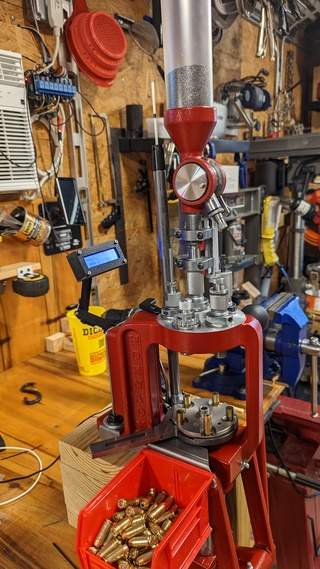

# PrimerCop

## A primer watchdog for a Hornady Lock-n-Load AP press

If you forget to press the handle forward at the end of a loading cycle, 
the primer is not seated in the case.  In a progressive press this is a problem.
It is a problem because the next step in the process is loading powder.  If there 
is not a primer plugging the primer cup, when your 'finished' round is ejected 
into the tray, powder starts falling out the case generally making a mess.

That's why I designed and use PrimerCop.  It keeps track of how many primers I've 
used (secondary function), and it emits a long beep until I press the arm forward
to seat the primer (primary function).

12/8/22 - Version 2 of the Pi Pico software is working and available in the Code
section.  Three hardware buttons were added. Two of them allow for adding or subtracting 
from the 'primercount' variable.  The third button resets everything.

Debouncing the buttons is done in software, and works pretty good.

### Older notes

12/6/22 - Version 1 of PrimerCop is functioning.  It's not what I'd call ready
for prime time, but it does work.

I'm working on getting a set of 3 buttons added.  Designing the mounting
solution for the buttons is the task du jour.
