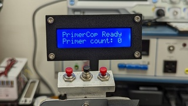
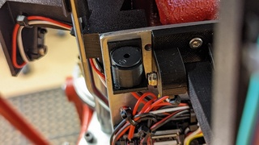
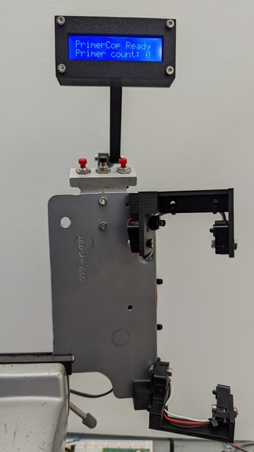
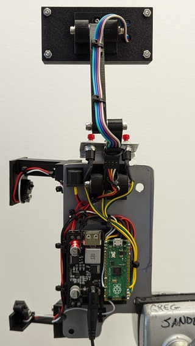

# PrimerCop

## A primer watchdog for a Hornady Lock-n-Load AP press

**The Problem:** If you forget to press the handle forward at the end of a loading cycle, 
the primer is not seated in the case.  

On a progressive press this is a problem.
It is a problem because the next step in the process is loading powder.  If there is not a primer plugging the primer cup when your 'finished' round is ejected into the tray, powder starts falling out the case generally making a mess.

That's why I designed PrimerCop.  It keeps track of how many primers I've used (secondary function), and it emits a long beep until I press the arm forward to seat the primer (primary function).

All images are [here on the /img readme.md](./img/readme.md).

PrimerCop uses two sets of Adafruit IR break-beam sensors which are triggered at the top and bottom of the cycle.

A Drok buck converter provides power to a Raspberry Pi Pico microcontroller running a Micropython app I wrote.

The mounts for everything are designed in OpenSCAD and are currently printed in PLA on a Prusa Mk3s.  I had thought I might want to print the parts with ABS, but after trying it once, I decided to stick with PLA because it is stiffer, not to mention easier.

The whole thing is built on a steel plate that bolts to the press with two 1/4-20 bolts screwed into the factory provided holes on the back of the press.

This makes for easy removal of the entire unit for any reason at any time.

### Changelog
**12/23/22** - v1.1.0 of bottom bracket.  The primer slide wheel was contacting it ever so slightly, but it was enough to cause a problem. This mod takes care of that.
             - v2.1.0 of main.py removes some unnecessary lines that were slowing things down.  Adding and subtracting to the count is quicker now.

**12/8/22** - Version 2 of the Pi Pico software is working and available in the Code
section.  Three hardware buttons were added. Two of them allow for adding or subtracting from the 'primercount' variable.  The third button resets everything.

Debouncing the buttons is done in software, and works pretty good.

**12/6/22** - Version 1 of PrimerCop is functioning.  It's not what I'd call ready
for prime time, but it does work.

I'm working on getting a set of 3 buttons added.  Designing the mounting
solution for the buttons is the task du jour.
